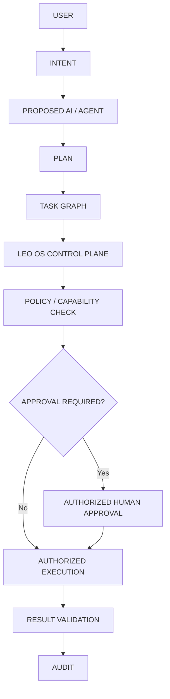

# LEO OS — Trust Boundary

**Status:** Design definition only. No future intelligence is implemented.

## Authority model
The LEO OS control plane is authoritative. AI/agents are untrusted principals whose proposals must be converted into governed control-plane state before execution.



## Authority responsibilities

- **Create objectives:** authorized human users according to existing organization/RBAC policy. A future agent may propose an objective but cannot grant itself authority to create one outside that policy.
- **Create tasks:** authorized control-plane actors/services. Future agents may propose tasks/task graphs; persistence remains governed by LEO OS.
- **Modify workflows:** control-plane-authorized actors and services subject to workflow transition rules. Agents cannot directly mutate durable workflow state.
- **Execute jobs:** authenticated, authorized workers through the existing execution boundary.
- **Approve risky actions:** an authorized human/approval principal satisfying approval policy; an agent cannot self-approve a consequential action.

## What agents may do
A future agent may:
- interpret authorized intent;
- produce candidate plans;
- propose task decomposition and dependencies;
- request a capability through an explicit tool interface;
- interpret validated results;
- request retry/escalation within defined policy.

## What agents may never directly control
Agents must never:
- obtain direct privileged database authority;
- bypass organization scoping;
- bypass capability/policy checks;
- bypass approval requirements;
- directly mutate terminal workflow state;
- create arbitrary workers or credentials;
- execute arbitrary external actions without an authorized tool, worker, policy decision, and required approval;
- rewrite audit history;
- turn model output into authority by assertion.

## Enforcement model
1. Identity establishes who is acting.
2. Organization ownership establishes where the action is allowed.
3. Task/workflow state establishes whether the action is currently legal.
4. Capability establishes what the worker may do.
5. Risk/policy establishes whether execution is allowed or requires approval.
6. Approval authorizes only the bound action, worker, job, organization, and relevant fingerprint/policy context.
7. Result validation determines whether execution may advance durable state.
8. Audit records consequential activity.

## Security invariants
- **Organization isolation:** all future intelligence is subordinate to persisted organization ownership; client/agent claims cannot redefine ownership.
- **Terminal protection:** agents cannot resurrect completed/cancelled terminal workflows through prompts or tool calls.
- **Retries/recovery:** agents do not own retry counters, leases, recovery, or durable workflow truth. The control plane does.
- **Auditability:** agent intent, plan references, decisions, approvals, execution outcomes, and relevant identities should be represented through governed audit mechanisms without storing secrets.
- **Fail closed:** high-risk and critical actions do not become executable merely because a model recommends them.

## Explicit prohibited path
```text
AGENT → DIRECT PRIVILEGED DB
AGENT → POLICY BYPASS
AGENT → APPROVAL BYPASS
AGENT → TERMINAL STATE MUTATION
AGENT → UNAUTHORIZED EXTERNAL EXECUTION
```

These paths are architecturally invalid.
