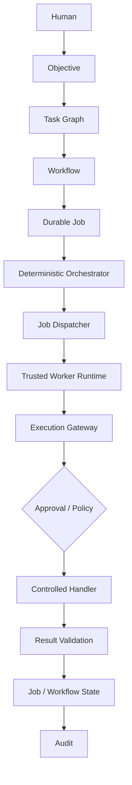
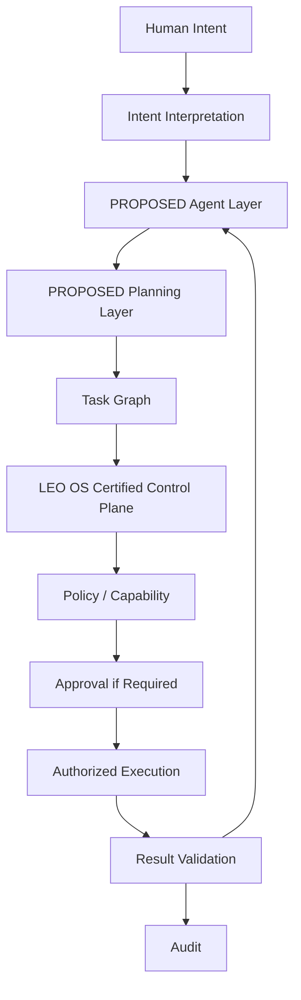

# LEO OS — Vision

**Status:** Architecture/Product Definition Only  
**Phase 1:** Frozen and certified  
**Phase 2:** Proposed, not implemented

## 1. Identity
LEO OS (Leadership & Execution Operating System) is a private company operating system for turning human intent into durable, controlled, auditable execution.

Phase 1 establishes the authoritative control plane. Future intelligence is an advisory/planning layer that connects to that control plane; it does not replace it.

## 2. Mission
Make company execution explicit, durable, policy-governed, recoverable, and auditable while keeping meaningful authority with authorized humans and the LEO OS control plane.

## 3. Core problem
Company work is often fragmented across intentions, plans, tasks, people, tools, approvals, and incomplete execution. LEO OS is intended to provide one durable execution model in which objectives become dependency-aware work, work becomes controlled execution, and every consequential state transition remains recoverable and auditable.

## 4. Target users
- Founder/CEO and authorized leadership.
- Operators responsible for executing company workflows.
- Administrators responsible for organization and policy configuration.
- Reviewers/approvers responsible for consequential actions.
- In the future, bounded AI agents acting as proposed planners/executors under human and control-plane authority.

## 5. Product promise
**Intent becomes accountable execution without surrendering authority to automation.**

## 6. What LEO OS is
- A durable workflow and execution control plane.
- A dependency-aware task system.
- A trusted-worker execution boundary.
- A policy, capability, approval, recovery, and audit boundary.
- Eventually, a host for bounded intelligence that proposes plans and actions through these controls.

## 7. What LEO OS is not
- Not an unrestricted autonomous agent.
- Not a generic chatbot.
- Not a model provider.
- Not a replacement for human authority.
- Not an unrestricted internet/action automation system.
- Not a hidden execution layer that can bypass policy, approvals, or audit.

## 8. Core concepts

| Concept | Meaning | State |
|---|---|---|
| Objective | Desired company outcome | Certified Phase 1 |
| Task | Atomic unit of planned work | Certified Phase 1 |
| Task Graph | Dependency structure and readiness model | Certified Phase 1 |
| Workflow | Durable lifecycle coordinating tasks/jobs | Certified Phase 1 |
| Job | Durable execution attempt and lease state | Certified Phase 1 |
| Worker | Trusted execution identity | Certified Phase 1 |
| Orchestrator | Deterministic workflow coordination | Certified Phase 1 |
| Execution Gateway | Privileged policy/capability/approval boundary | Certified Phase 1 |
| Handler | Controlled executable operation | Certified Phase 1 |
| Result Validation | Boundary that decides whether execution output is acceptable | Certified Phase 1 |
| Approval | Durable human authorization for governed actions | Certified Phase 1 |
| Audit | Durable record of consequential control-plane activity | Certified Phase 1 |
| Organization | Security/ownership boundary | Certified Phase 1 |
| Future Agent | Bounded intelligence that proposes/plans/acts through LEO OS | Proposed |
| Future Model | Replaceable reasoning capability behind an agent | Proposed |
| Future Tool | Explicitly authorized capability exposed to agents | Proposed |
| Human-in-the-loop | Human authority at defined decision gates | Certified foundation; future expansion proposed |

## 9. Future intelligence boundary
Future agents may interpret intent, generate candidate plans, decompose work, propose task graphs, interpret results, and request authorized tool execution. Their output is untrusted input to the control plane.

Future models are implementation details behind an explicit model abstraction. A model response never becomes authority merely because it is confident, structured, or generated by a trusted provider.

Future tools are capabilities, not privileges. An agent requests a tool action; LEO OS evaluates identity, organization, capability, risk, workflow state, approval requirements, and audit obligations before authorized execution.

## 10. Human-in-the-loop
Humans retain authority over objectives, organization permissions, policy, consequential approvals, escalation, cancellation, and other explicitly governed decisions. Automation may reduce mechanical work without silently expanding authority.

## 11. Current certified architecture

Everything above is certified Phase-1 architecture; the diagram does not imply unrestricted external execution.

## 12. Future direction

**PROPOSED / NOT IMPLEMENTED:** Intent Interpretation, Agent Layer, Planning Layer, and any future intelligence/model/tool infrastructure.

## 13. Architectural north star
**Agents propose. LEO OS decides. Authorized workers execute. Humans retain authority where policy requires it.**
