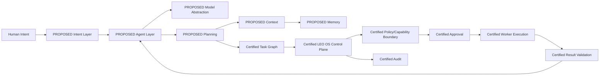

# LEO OS — Phase 2 Architecture

**Status: PROPOSED / NOT IMPLEMENTED**  
**Phase 1:** Frozen. This document defines extension points only.

## 1. Design rule
Phase 2 adds intelligence around the certified control plane; it does not replace the control plane.

## 2. Proposed component map



## 3. Agent layer
A bounded agent would own reasoning and proposal generation, not execution authority. Agent state should be resumable through explicit control-plane jobs rather than hidden in process memory.

## 4. Model abstraction
A future model interface should normalize model requests/results, budgets, timeouts, failure categories, and provenance. Models are replaceable reasoning engines, not authorities. Model selection must be explicit and policy-governed; no uncontrolled model switching.

## 5. Planning layer
Planning converts authorized intent into candidate objectives/tasks/dependencies. It should produce structured proposals that the control plane validates before durable creation. Planning must not directly persist arbitrary privileged state.

## 6. Context system
Context supplies only authorized, relevant information to an agent. Organization, workflow, task, approval, and worker boundaries remain authoritative. Context assembly must not become an implicit privilege escalation path.

## 7. Memory system
Future memory should distinguish durable company facts, workflow state, task history, and ephemeral reasoning context. Durable control-plane truth must remain in the certified sources of truth; memory cannot override workflow/job state.

## 8. Tool abstraction
A future tool is an explicit capability contract: identity, required capability, risk classification, input/output schema, authorization requirements, and audit semantics. Tools should route through the Execution Gateway and authorized workers rather than create parallel privileged paths.

## 9. Permission and policy
Reuse the existing organization/RBAC, worker identity, capability, execution-risk, approval, ownership, and terminal-state controls. Future agent permissions should be narrower than the authority available to the underlying control plane.

## 10. Approval integration
When policy requires approval, the agent can request approval but cannot approve itself. Approval must bind to the consequential action context and remain single-use under the certified approval model.

## 11. Task Graph generation
Agents may propose a graph. The existing graph validation and deterministic readiness/selection logic remains authoritative. Invalid, cyclic, duplicate, self-dependent, or cross-organization proposals are rejected by the control plane.

## 12. Agent execution loop
Conceptually:

```text
observe authorized context
→ reason
→ propose next action
→ submit to control plane
→ await policy/approval/execution result
→ interpret validated result
→ continue, retry, escalate, or stop
```

The loop is bounded by durable jobs/workflows, policy, budgets, cancellation, and human escalation. It is not an unrestricted autonomous loop.

## 13. Result interpretation
Agents may interpret validated outputs. They cannot mark a job successful merely by producing a success-looking message. Durable success remains determined by existing execution/result-validation boundaries.

## 14. Retry and recovery
Agents may recommend retry or escalation. Job retry limits, leases, stale recovery, checkpoints, reconciliation, and terminal protection remain owned by the control plane.

## 15. Observability
Future intelligence should expose model/agent provenance, latency, token/cost metadata where available, decisions, tool requests, policy outcomes, approvals, and failures through controlled observability and audit records without leaking secrets.

## 16. Cost controls
Potential controls include per-organization budgets, per-workflow budgets, per-agent/model budgets, action limits, context limits, and escalation thresholds. Budget exhaustion should fail closed or require an explicit authorized decision.

## 17. Model failure handling
Treat timeouts, malformed outputs, unavailable models, unsafe/invalid proposals, and inconsistent structured output as failures. Never silently substitute a different authority. A fallback model, if later permitted, must remain inside explicit policy and provenance rules.

## 18. Agent failure handling
Persist sufficient durable state to recover a failed agent attempt. The agent process may fail; the workflow/job state must remain recoverable. Stale leases and reconciliation remain control-plane mechanisms.

## 19. Tool failure handling
Normalize tool failures into structured results. Retry only according to existing policy. Never turn a tool exception into assumed success.

## 20. Human escalation
Escalate when policy requires approval, ambiguity exceeds configured bounds, risk is high, budgets are exhausted, repeated failures occur, or the agent cannot safely proceed. Humans can cancel or redirect governed work.

## 21. Security boundaries
The minimum boundary is:

```text
Agent
  ↓ proposal/request only
Control Plane
  ↓ policy/capability/approval
Authorized Worker
  ↓ controlled handler
Result Validation
  ↓
Durable State + Audit
```

No future Phase-2 component may introduce a shadow execution path.

## 22. Extension rule
Phase 2 must integrate with existing Phase-1 primitives. Replacing the orchestrator, workflow state machine, job lifecycle, execution gateway, approval boundary, or audit source of truth would require a separate architectural decision and is outside this definition.
